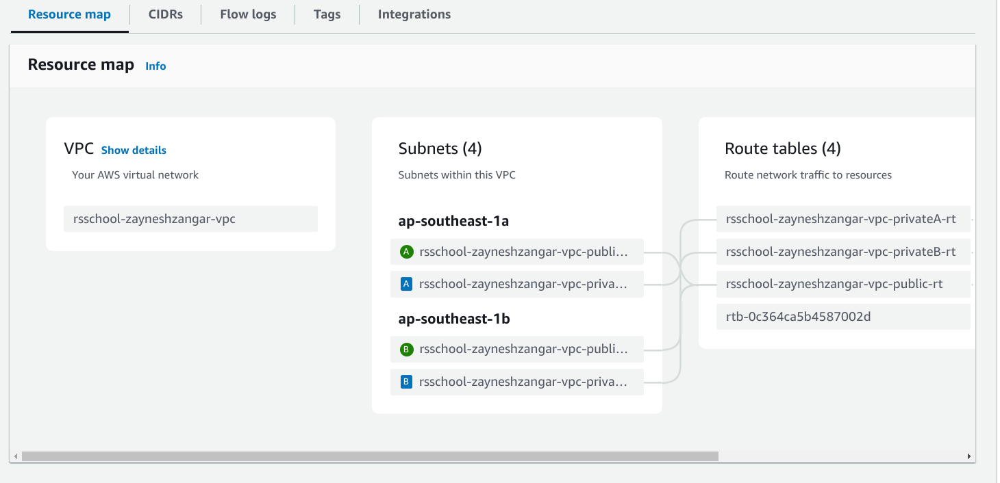
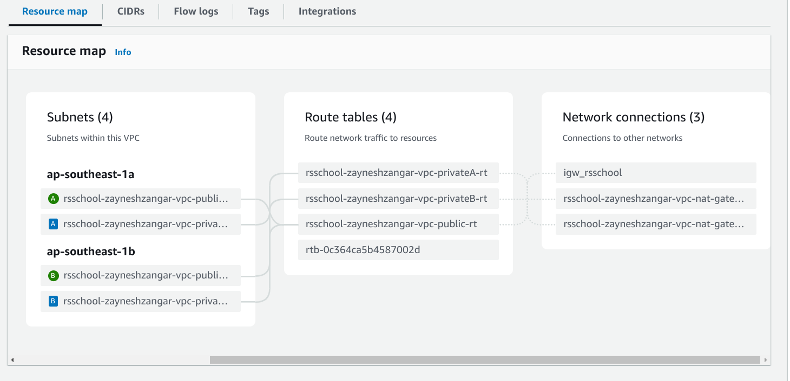

# TASK 2: Basic Infrastructure Configuration

### Project Hierarchy
```
.
├── bastion-host
│   ├── autoscaling_group.tf
│   ├── data.tf
│   ├── launch_configuration.tf
│   ├── provider.tf
│   ├── security_group.tf
│   └── variables.tf
├── ec2
│   ├── data.tf
│   ├── ec2.tf
│   ├── provider.tf
│   ├── security_group.tf
│   └── variables.tf
├── key-pair
│   ├── key-pair-plan.txt
│   ├── key_pair.tf
│   ├── provider.tf
│   └── variables.tf
├── README.md
└── vpc
    ├── eip.tf
    ├── igw.tf
    ├── nat_gw.tf
    ├── provider.tf
    ├── route_table.tf
    ├── route.tf
    ├── rt_association.tf
    ├── subnets.tf
    ├── variables.tf
    ├── vpc-plan.txt
    └── vpc.tf
```

## Terraform VPC Infrastructure

This Terraform project sets up a Virtual Private Cloud (VPC) in AWS with the following components:
- **VPC**: A rsschool-zayneshzangar-vpc VPC.
- **Subnets**:
    - 2 public subnets in different Availability Zones (AZs).
    - 2 private subnets in different AZs.
- **Internet Gateway**: To allow internet access for resources in public subnets.
- **Internet Gateway**: To allow internet access for resources in public subnets.
- **Routing Configuration**:
    - Instances in all subnets can communicate with each other.
    - Instances in public subnets can access the internet, and the internet can access them.

## Organization of Terraform Code

### Separation of Variables
All configurable variables are defined in the variables.tf file. This includes settings for:
- VPC CIDR block
- Subnet CIDR blocks
- Availability Zones
- Other customizable parameters

## Separation of Resources
Resources are divided into separate .tf files for better organization. This allows each file to focus on a specific component, making it easier to navigate and maintain.

Here's the breakdown of resource files:
- `vpc.tf`: Defines the VPC resource.
- `subnets.tf`: Configures the public and private subnets.
- `igw.tf`: Provisions the Internet Gateway for public subnets.
- `nat_gw.tf`: Configures the NAT Gateway for private subnets.
- `route_table.tf`: Sets up the route tables for public and private subnets.
- `route.tf`: Defines the routes to allow communication between subnets and internet access for public subnets.
- `rt_association.tf`: Associates subnets with their respective route tables.
- `eip.tf`: Allocates Elastic IPs for the NAT Gateway.

### Example of how the resources are divided:
```
├── vpc
│   ├── eip.tf                # Elastic IPs for NAT Gateway
│   ├── igw.tf                # Internet Gateway configuration
│   ├── nat_gw.tf             # NAT Gateway for private subnets
│   ├── provider.tf           # AWS provider configuration
│   ├── route_table.tf        # Route table configurations
│   ├── route.tf              # Routing rules for subnets and NAT
│   ├── rt_association.tf     # Route table associations with subnets
│   ├── subnets.tf            # Public and private subnets
│   ├── variables.tf          # Variables to customize the VPC and subnets
│   ├── vpc-plan.txt          # Terraform plan for the infrastructure
│   └── vpc.tf                # VPC definition
```

### Key Resources:
- **VPC**: A virtual private network that hosts all subnets.
- **Public Subnets**: Subnets with internet access via the Internet Gateway.
- **Private Subnets**: Subnets that use a NAT Gateway to access the internet, without direct internet access from outside.
- **Internet Gateway (IGW)**: Allows public subnets to access the internet.
- **NAT Gateway**: Enables instances in private subnets to initiate outbound traffic to the internet while remaining unreachable from the outside.

### Prerequisites
- AWS account
- Terraform installed (Install Terraform)
- IAM permissions to manage VPC, subnets, and other resources

### Usage

1. Clone this repository:
```
git clone git@github.com:zayneshzangar/rsschool-devops-course-tasks.git
cd task_2/vpc
```

2. Initialize the Terraform workspace:
```
terraform init
```

3. Review the variables in variables.tf and adjust them according to your requirements.
4. Generate a plan:
```
terraform plan
```

5. Apply the configuration:
```
terraform apply -auto-approve
```

This will create the VPC, subnets, routing tables, and other resources defined in the files.

## Verification
`Terraform plan` is executed successfully.

You can see the success of `terraform plan` in the `plan-files` folder

A resource map screenshot is provided


AND:


## Additional Tasks

### Security Groups and Network ACLs
- `bastion-host` and `ec2` folder contain the security group files. There, access is open via port 22 on the internal and everything is available on the external.

### Bastion Host
The bastion code is located in the `bastion-host` folder

- `NAT Instance`: Allows instances in private subnets to reach addresses outside the VPC in a cost-effective manner.
- `Routing Configuration`:
    - Instances in private subnets route outbound traffic through the NAT Instance.
    - Instances in public subnets have direct access to the internet.


