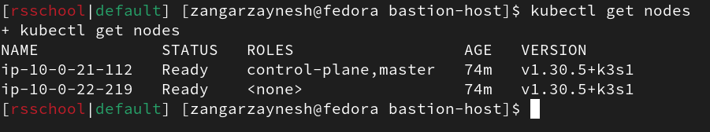
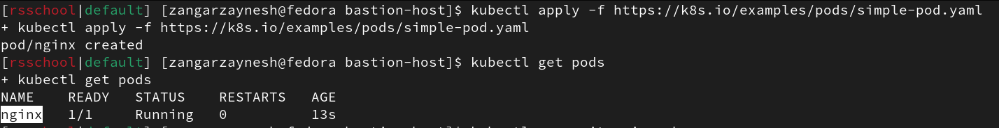

# Task 3: K8s Cluster Configuration and Creation

1. Terraform Code for AWS Resources
    - Terraform code is created or extended to manage AWS resources required for the cluster creation.
    ```
    .
    ├── bastion-host
    │   ├── bastion.tf
    │   ├── data.tf
    │   ├── eip_association.tf
    │   ├── outputs.tf
    │   ├── provider.tf
    │   ├── security_group.tf
    │   └── variables.tf
    ├── ec2
    │   ├── data.tf
    │   ├── ec2.tf
    │   ├── outputs.tf
    │   ├── provider.tf
    │   ├── security_group.tf
    │   └── variables.tf
    ├── eip
    │   ├── eip.tf
    │   ├── output.tf
    │   ├── provider.tf
    │   └── variable.tf
    ├── README.md
    └── screens
        ├── kgno.png
        └── kgpo-ka.png
    ```
    - The code includes the creation of a bastion host
    ```
    .
    ├── bastion.tf
    ├── data.tf
    ├── eip_association.tf
    ├── outputs.tf
    ├── provider.tf
    ├── security_group.tf
    └── variables.tf
    ```

2. Cluster Deployment
    - A K8s cluster is deployed using either kOps or ***k3s***.
    - The deployment method is chosen based on the user's preference and understanding of the trade-offs.
    ```
    If you look in the task-3/ec2/ec2.tf file, then there you will find how I use the k3s installation method
    ```

3. Cluster Verification
    - The cluster is verified by running the `kubectl get nodes` command from the local computer
    - A screenshot of the `kubectl get nodes` command output is provided
        

4. Workload Deployment
    - A simple workload is deployed on the cluster using `kubectl apply -f https://k8s.io/examples/pods/simple-pod.yaml`
    - The workload runs successfully on the cluster
      


```
Note! There is a cabbage terraform order here.
1. Launches terraform in the eip folder. You can run it manually or via Github Actions. Why are we launching 1 eip? So that we can create an immutable ip address for bastion in advance. When we get kubeconfig and write this ip address there once
2. Launching ec2. You may ask why not bastion? But in the script when installing bastion, I have a dependency on ec2. That is, when I raise bastion, I need the ip address master mode to set up redirection of k3s requests via haproxy
3. Launching bastion so that you can access k3s
```