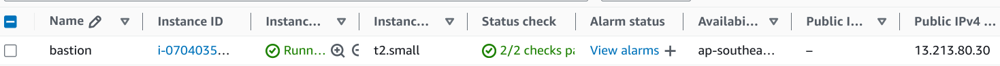

# Task 4: Jenkins Installation and Configuration

1. Helm Installation and Verification
    - Helm is installed and verified by deploying the Nginx chart
      

      When installing nginx help, I downloaded values.yaml file to assign a different name to the deployment
      

      After installing nginx helm, you can view the list of helms
      

      You can also see the pod launched using the helm chart
      

      If you want to delete the running helm, then you can use the command
      

2. Cluster Requirements
    - The cluster has a solution for managing persistent volumes (PV) and persistent volume claims (PVC).

```
In the pv-pvc folder, I created a test pv and pvc. To do this, I needed:
    - ServiceAccount.yaml
    - ClusterRole.yaml
    - ClusterRoleBinding.yaml
    - label.sh
    - PersistentVolume.yaml
    - PersistentVolumeClaim.yaml
    - test-pod.yaml

All this needs to be started in order. These yaml files are located in the task-4/pv-pvc folder.
```

We see here that persistent volume and persistent volume claim have been created.


You can also view how volume is related to persistent volume claim


3. Jenkins Installation

Before installing jenkins, I want to prepare the infrastructure for jenkins. I'm using previous assignments. When creating bastion, I install haproxy to redirect requests to the cluster. And I have configured all requests on port 80 for jenkins. You can look at the task-3/basion-host/bastion.tf path.


And you also need to open a port in the worker nad 30080 port so that the outside can have access to jenkins. (task-3/ec2/security_group.tf)


I use helm. To change the jenkins-help setting, I downloaded values.yaml file by link https://raw.githubusercontent.com/jenkins-infra/jenkins.io/master/content/doc/tutorials/kubernetes/installing-jenkins-on-kubernetes/jenkins-sa.yaml. Then renamed to jenkins-values.yaml.

In this file, I added the Node Port service type and added port 30080.


Running the script `jenkins-requirements.sh` on path task-4/jenkins/. The script executes:
    - Adds label`worker: apps` for worker where jenkins should be launched
    - Create namespace jenkins
    - Create voleme for jenkins
    - Create ClusterRole and ClusterRoleBinding for jenkins


Add jenkins in local repo:
    - helm repo add jenkinsci https://charts.jenkins.io
    - helm repo update
    - helm search repo jenkinsci

Installing jenkins in the cluster:
    - cd task-4/jenkins
    - chart=jenkinsci/jenkins
    - helm install jenkins -n jenkins -f jenkins-values.yaml $chart

If you want to change something in the settings of the running jenkins, you should change the jenkins-values.yaml file and run the command:
    - cd task-4/jenkins
    - chart=jenkinsci/jenkins
    - helm upgrade --install jenkins -n jenkins -f jenkins-values.yaml $chart

First, let's get bastion's external ip address to access jenkins


After installation, we can link to port 80 bastion and we will see in the jenkins browser


Let's create a user for jenkins


We will also create a freestyle project and run it in the console


